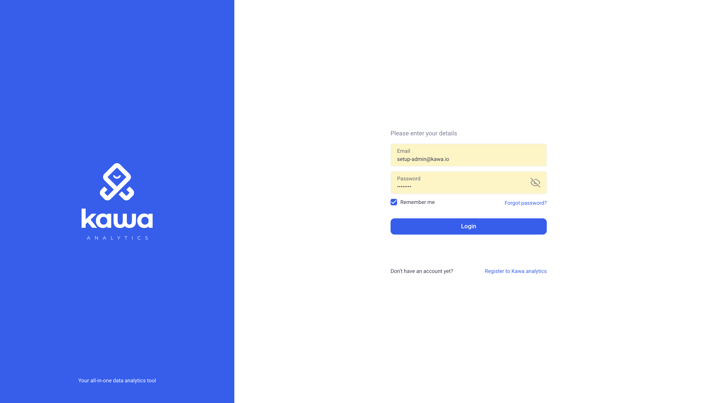

# KAWA Installation

This installation process is meant for simple on premise deployments.


## 1. Prerequisites

### 1.a General requirements

We currently support Ubuntu Systems 20.04, 22.04 and 24.04 LTS.
Compatibility with other linux distributions should work fine but was not tested.

Here is what you will need:

- You need an account with the ability to run sudo on the target machine

- Access and Credentials to our registry here: [Gitlab registry](registry.gitlab.com/kawa-analytics-dev).

- A valid KAWA license.


### 1.b Hardware requirements

__RAM__

For small amounts of data (up to ~200 GB compressed), it is best to use as much memory as the volume of data. For large amounts of data and when processing interactive (online) queries, you should use a reasonable amount of RAM (128 GB or more) so the hot data subset will fit in the cache of pages. Even for data volumes of ~50 TB per server, using 128 GB of RAM significantly improves query performance compared to 64 GB.

__CPU__

KAWA will use all available CPU to maximize performance. So the more CPU - the better. For processing up to hundreds of millions / billions of rows, the recommended number of CPUs is at least 64-cores. We only support AMD64 architecture.

__Storage Subsystem__

SSD is preferred. HDD is the second best option, SATA HDDs 7200 RPM will do. The capacity of the storage subsystem directly depends on the target analytics perimeter.


## 2. Installation procedure

The installation procedure will install all the KAWA components:

- A postgres database
- A clickhouse data warehouse
- The KAWA server
- The KAWA script runner

All these components can be installed separately if you wish.


### 2.a Installation steps

1) Clone this repository on the target machine
```bash
git clone https://github.com/kawa-analytics/kawa-install.git
cd kawa-install
```

2) Input your token: 
```bash
echo 'gldt-*******' > configuration/deploy.token
```
3) Run the installation script as root: 
```bash
sudo ./install.sh
```

> **⚡ Important:** During the installation process, you will be prompted for the password for the system user on clickhouse. Keep it safe, it will be necessary further down the installation.


### 2.b Test login on the WEB UI

Connect to the web server from a web browser to test the installation:

By default, KAWA will listen on port 8080.


The default credentials are:
```
login: setup-admin@kawa.io
password: changeme
```

<p align="center">
  
</p>


## 3. Initial configuration

The initial configuration can be done following the documentation hosted here: [KYWY doc github](https://github.com/kawa-analytics/kywy-documentation).

Follow the README and then:  [Initial setup Notebook](https://github.com/kawa-analytics/kywy-documentation/blob/main/notebooks/administration/02_initial_instance_configuration.ipynb)


## 4. Exploitation


